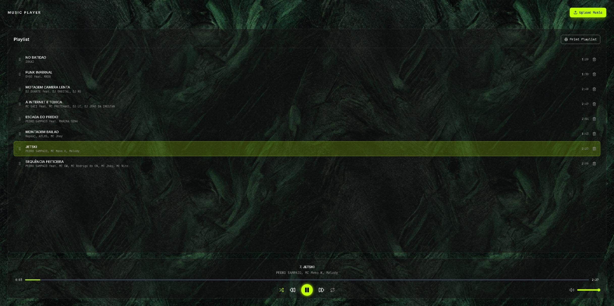

# 🎵 Music Player Application

A full-stack, modern music player web application built as a monorepo. It features a robust backend API for managing audio files and a responsive, highly-polished frontend interface for playing music, managing playlists, and uploading tracks.

## 🏗 Architecture

The repository is structured as a monorepo containing two main projects:
- **Frontend** (`projects/frontend`): A responsive Single Page Application (SPA) built with React.
- **Backend** (`projects/backend`): A scalable REST API built with NestJS to handle track metadata, file uploads, and streaming.

### 💻 Technologies

**Frontend Stack:**
- **React 19** & **Vite** - Fast, modern frontend framework and bundler.
- **TypeScript** - Strongly typed codebase.
- **Tailwind CSS v4** - Utility-first styling with custom CSS variables for a themeable UI.
- **React Router DOM** - Client-side routing.
- **React Hook Form** & **Zod** - Robust form state management and schema validation.
- **Lucide React** - Clean and consistent iconography.
- **Axios** - Promise-based HTTP client for API requests.

**Backend Stack:**
- **NestJS v11** - Progressive Node.js framework for scalable server-side applications.
- **TypeScript** - Strongly typed server-side code.
- **Prisma ORM** - Next-generation Node.js and TypeScript ORM for database interactions.
- **Multer** - Middleware for handling `multipart/form-data` (audio file uploads).
- **Pino** - Extremely fast Node.js logger.
- **Swagger / OpenAPI** - Automated API documentation.
- **Jest** - Unit and end-to-end testing framework.

**DevOps & Tooling:**
- **Docker & Docker Compose** - Containerized database and local environments.
- **Husky & Lint-Staged** - Git hooks for code quality.
- **ESLint & Prettier** - Static code analysis and code formatting.

## 📂 Project Structure

```text
music-player-dsa/
├── projects/
│   ├── frontend/         # React SPA frontend application
│   └── backend/          # NestJS REST API backend application
├── designs/              # Pencil (.pen) design files
├── docker-compose.dev.yml # Docker compose for local database/services
├── package.json          # Root workspace configuration
└── README.md             # Project documentation
```

## 🎨 UI & Design

The application's interface was designed using [Pencil](https://pencil.app/) and includes interactive states, neon-glow effects, and a dark textured aesthetic. The original design specifications can be found in the root folder:
- `app.pen` / `music-player.pen` - Main player and playlist interface.
- `upload-music.pen` - Interactive track upload states (form, uploading, success, error).
- `design-system.pen` - Reusable UI components.

## 🚀 Setup & Installation

### Prerequisites
- [Node.js](https://nodejs.org/) (v20+ recommended)
- [Docker Desktop](https://www.docker.com/products/docker-desktop) (for running the local database)
- npm or yarn

### 1. Environment Setup

Copy the example environment files and configure them:

```bash
# In the root directory
cp .env.example .env

# Configure your environment variables inside .env appropriately
```

### 2. Install Dependencies

Install the dependencies for both frontend and backend from the root:

```bash
npm install
```
*(If the root `package.json` relies on workspaces, this installs everything. Otherwise, navigate to each project folder and run `npm install`)*

```bash
cd projects/frontend && npm install
cd ../backend && npm install
```

### 3. Start the Database (Docker)

Spin up the local PostgreSQL database (and any other required services) using Docker Compose:

```bash
docker-compose -f docker-compose.dev.yml up -d
```

### 4. Database Migrations

Navigate to the backend directory and run the Prisma migrations to set up your schema:

```bash
cd projects/backend
npm run db:generate
npm run db:migrate
```

## 🏃 Running the Application

### Start the Backend

```bash
cd projects/backend
npm run start:dev
```
The backend API will typically run on `http://localhost:3000` (or as defined in your `.env`). Swagger API documentation can be accessed at `http://localhost:3000/api` (or `/docs`).

### Start the Frontend

In a separate terminal:

```bash
cd projects/frontend
npm run dev
```
The frontend application will start on `http://localhost:5173`. Open this URL in your browser to experience the Music Player.

## 🧪 Testing

Both projects come with testing configured:

**Backend:**
```bash
cd projects/backend
npm run test        # Unit tests
npm run test:e2e    # End-to-end tests
```

**Frontend:**
```bash
cd projects/frontend
npm run test        # Runs Vitest
```

## 📄 License

This project is proprietary and for demonstration/educational purposes.
